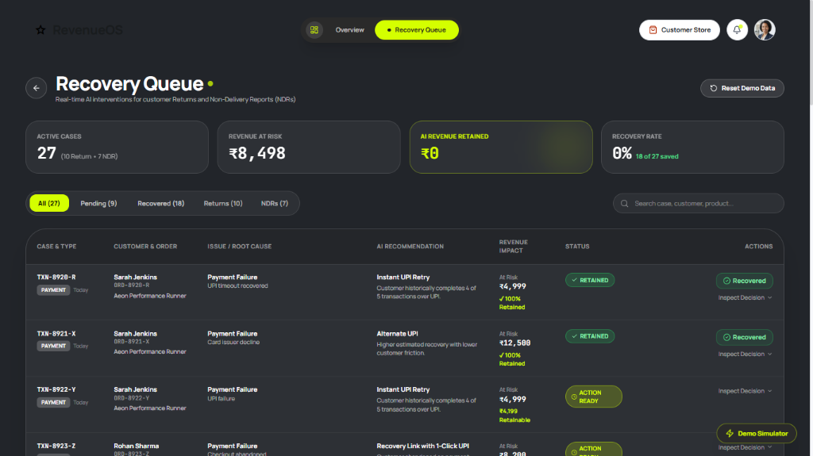
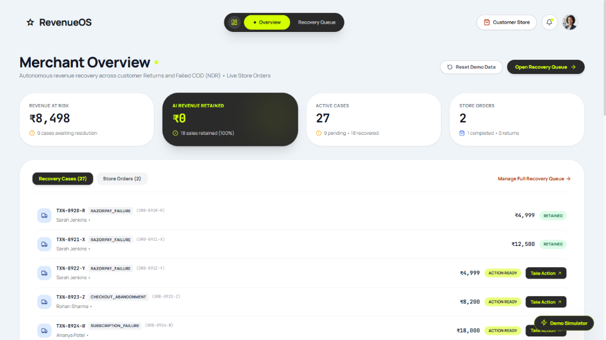
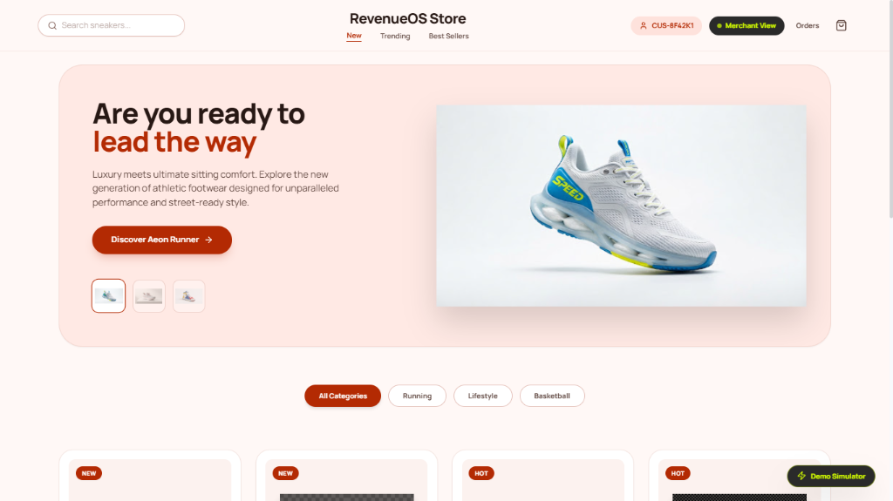
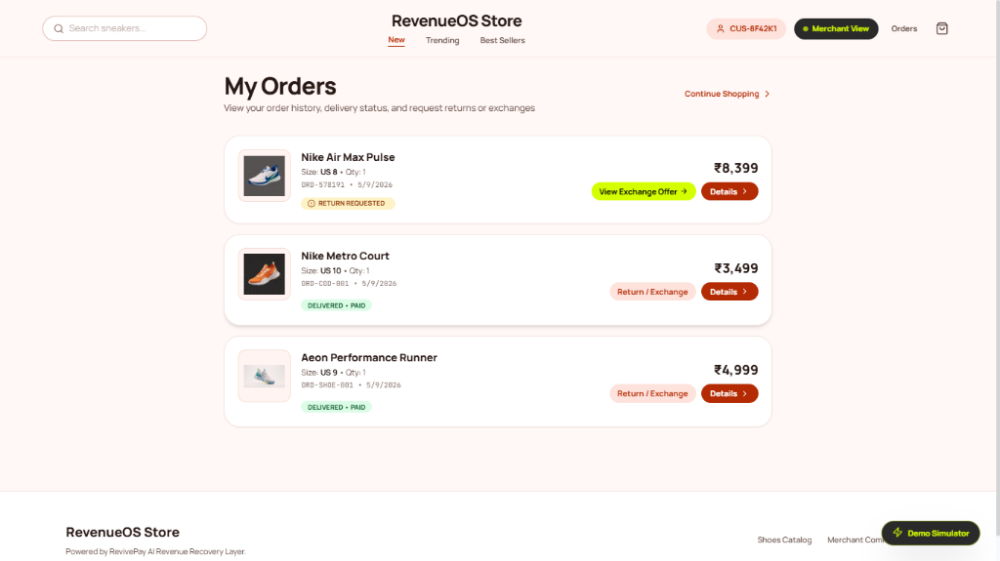
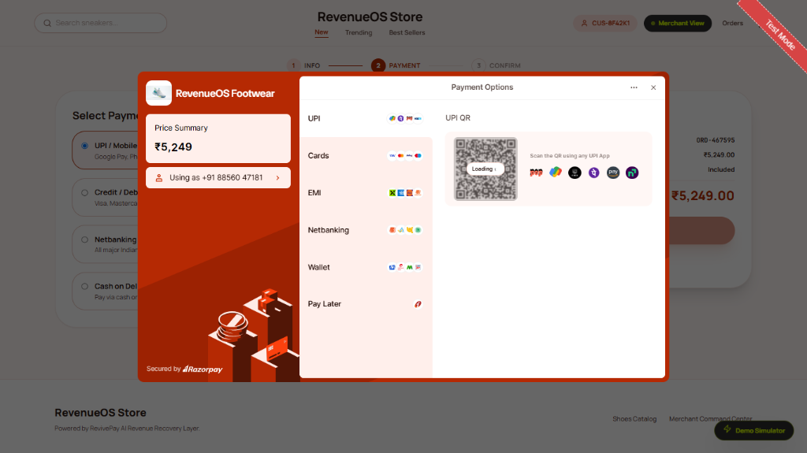

<div align="center">

# ⚡ RevivePay

### **Autonomous AI Revenue Recovery & Checkout Resilience Engine for E-Commerce**

[](https://nextjs.org/)
[](https://www.typescriptlang.org/)
[](https://tailwindcss.com/)
[](https://ai.google.dev/)
[](https://firebase.google.com/)
[](https://razorpay.com/)
[](LICENSE)

<p align="center">
  <b>Find revenue that’s slipping away and win it back.</b><br>
  An intelligent multi-agent system that intercepts post-purchase returns, salvage-fails Cash-on-Delivery (NDR) drop-offs, and recovers failed checkout payments in real time.
</p>

<p align="center">
  
</p>

[Explore Features](#-key-features) •
[Screenshots Gallery](#-visual-showcase) •
[Architecture](#-system-architecture) •
[Live Demo Flows](#-golden-path-demo-flows) •
[Quickstart](#-quickstart--local-setup) •
[API Docs](#-api-endpoints--services)

---

</div>

<br>

## 📋 Table of Contents

- [💡 Problem Statement & Vision](#-problem-statement--vision)
- [✨ Key Features](#-key-features)
- [📸 Visual Showcase & Screenshots](#-visual-showcase)
- [🔄 Golden Path Demo Flows](#-golden-path-demo-flows)
- [🏗️ System Architecture & Data Pipeline](#-system-architecture)
- [🧠 AI Decision Engine & Mathematical Scoring](#-ai-decision-engine--mathematical-scoring)
- [🛡️ Guardrails & Policy Constraints](#-guardrails--policy-constraints)
- [💻 Tech Stack](#-tech-stack)
- [📂 Project Directory Structure](#-project-directory-structure)
- [🚀 Quickstart & Local Setup](#-quickstart--local-setup)
- [🔌 API Endpoints & Services](#-api-endpoints--services)
- [🧪 End-to-End Testing](#-end-to-end-testing)
- [📜 Firebase Firestore Rules](#-firebase-firestore-rules)
- [🤝 Contributing & License](#-contributing--license)

---

## 💡 Problem Statement & Vision

In online e-commerce—especially high-velocity categories like footwear and apparel—merchants bleed **15% to 30%** of their GMV after the customer clicks "Buy":

1. **Post-Purchase Sizing Returns**: Customers return products simply due to incorrect shoe sizing. Merchants immediately issue full refunds, permanently losing customer acquisition cost (CAC) and GMV.
2. **Cash-on-Delivery (COD) / Non-Delivery Reports (NDR)**: Customers are absent, lack physical cash, or experience delivery hesitation. Packages return to origin (RTO), doubling forward and reverse logistics costs.
3. **Checkout Payment Failures**: Bank downtime, UPI timeout, or card decline lead to instant drop-offs without immediate intelligent intervention.

> ### 🎯 RevivePay's Mission
> Instead of treating revenue loss as a passive refund or static notification, **RevivePay** operates as an **autonomous, explainable, and bounded AI Revenue Recovery Layer**. It evaluates root causes via **Google Gemini**, simulates strategy values, respects strict merchant guardrails, and executes dynamic conversions (such as **1-click size exchanges** and **COD-to-Prepaid conversion with instant UPI incentives**) in real time.

---

## ✨ Key Features

### 1. 👟 Post-Purchase Return Interception (Size Exchange)
- Intercepts return requests before money leaves the merchant’s account.
- Evaluates real-time warehouse inventory for matching replacement sizes.
- Presents a 1-click **Size Exchange** confirmation, retaining **100% order revenue** while reducing customer friction.

### 2. 🚚 COD / NDR Recovery Engine (Prepaid Conversion)
- Automatically triggers upon delivery notification failures (e.g. *Customer cash unavailable*).
- Formulates high-conversion recovery offers (e.g. **Instant ₹250 UPI Cashback** or **Free Express Re-dispatch**).
- Dispatches secure Razorpay payment recovery links, transforming high-risk COD into guaranteed prepaid revenue.

### 3. 🧠 Multi-Agent Gemini AI Diagnostic Engine
- **Failure Cause Analysis**: Categorizes underlying friction (insufficient funds, technical gateway drop, fit mismatch, impulse cold-feet).
- **Predictive Probability**: Computes calibrated recovery probabilities ($0.00 - 1.00$).
- **Strategic Utility Scoring**: Determines whether an automated retry, customer link, discount offer, or human escalation provides the highest Net Expected Recovery.

### 4. 🛡️ Bounded Autonomy & Deterministic Guardrails
- **Hard Stopping Rules**: Maximum 2 automated retry attempts to prevent customer annoyance and API spamming.
- **Value Thresholds**: High-value transactions exceed threshold limits and automatically require Merchant Approval.
- **Zero Hallucination Risk**: Payment amounts, balances, and database writes are governed by immutable backend code, never raw LLM strings.
- **Full Auditability**: Every single event, strategy matrix, and decision note is logged to an immutable Firestore audit ledger.

### 5. ⚡ Real-Time Bi-Directional Dashboard
- Zero manual refreshes needed. Built using **Firebase Firestore `onSnapshot` real-time listeners**.
- When a customer triggers a return or completes an exchange on the storefront, the **Merchant Command Center** updates KPIs, charts, and recovery queues instantly.

### 6. 🧪 Built-In Interactive Scenario Simulator
- Test realistic edge cases on-demand with a single click:
  - *Size Issue Return* (Aeon Performance Runner)
  - *Cash Unavailable NDR* (COD Delivery Failure)
  - *Checkout Card Decline / UPI Drop*
- Allows setting custom amounts and viewing live agent reasoning in seconds.

---

## 📸 Visual Showcase

Explore RevivePay in action across both the **Merchant Revenue Command Center** and the **Customer Storefront**:

<br>

### 1. Merchant Command Center Overview (`/merchant/overview`)
> *Real-time financial visibility displaying Revenue at Risk (₹8,498), AI Revenue Retained, Active Cases triage, and Live Store Orders synchronized via Firebase Firestore.*

<p align="center">
  
</p>

---

### 2. Real-Time AI Recovery Queue (`/merchant/recovery`)
> *Granular case triage showcasing root-cause diagnosis (UPI Timeout, Card Decline, Checkout Abandonment), AI recommendations (Instant UPI Retry, Alternate UPI, 1-Click Recovery Link), revenue impact, and 1-click execution actions.*

<p align="center">
  
</p>

---

### 3. RevenueOS Footwear Storefront (`/store`)
> *High-end athletic footwear consumer storefront with real-time catalog browsing, the flagship Aeon Performance Runner showcase, category filtering, and direct customer profile integration.*

<p align="center">
  
</p>

---

### 4. Customer Orders & Post-Purchase Exchange Interception (`/store/orders`)
> *Customer-facing order portal showing active delivery status and the autonomous **"View Exchange Offer"** AI intervention button converting return requests into retained GMV size exchanges.*

<p align="center">
  
</p>

---

### 5. Dynamic Payment Rails & Razorpay Checkout (`/store/checkout`)
> *Integrated Razorpay Test Mode checkout displaying dynamic UPI QR code, Cards, Netbanking, Wallets, and dynamic recovery payment options for instantaneous friction reduction.*

<p align="center">
  
</p>

---

## 🔄 Golden Path Demo Flows

RevivePay links the **Customer Experience** and **Merchant Intelligence** into three deterministic lifecycles:

```
┌─────────────────┐       ┌─────────────────┐       ┌─────────────────┐       ┌─────────────────┐
│ Customer Store  │ ────► │ Failure / Event │ ────► │  Gemini AI      │ ────► │ Realtime        │
│ & Checkout      │       │ (Return/NDR/Pay)│       │  Orchestration  │       │ Merchant Sync   │
└─────────────────┘       └─────────────────┘       └─────────────────┘       └─────────────────┘
```

### Flow A: Post-Purchase Return Interception (Size Exchange)
1. **Purchase**: Customer buys *Aeon Performance Runner* (Size 9) for **₹4,999**.
2. **Issue**: Customer receives shoe, realizes size 9 is tight, and submits a return request for a refund.
3. **AI Interception**: Gemini detects that the return cause is fit-related (`size_exchange`). The system queries warehouse inventory for Size 10.
4. **Offer Generation**: The customer portal presents: *"Size 10 in stock! Get an instant priority exchange with free dispatch instead of waiting 7 days for a bank refund."*
5. **Customer Confirms**: Customer taps **"Confirm Exchange"**.
6. **Outcome**: The return is converted to an exchange. **₹4,999 GMV is saved**, refund liability is dropped to ₹0, and the Merchant Dashboard immediately increments **AI Recovered Revenue**.

### Flow B: COD Cash Unavailable (NDR to Prepaid Conversion)
1. **Delivery Attempt**: Courier reaches customer address for a **₹3,499** COD order. Customer does not have exact cash.
2. **NDR Trigger**: Logistics event reports *Payment Not Received / Cash Unavailable*.
3. **AI Evaluation**: Gemini calculates high recovery probability (88%) if payment friction is removed and suggests an incentive.
4. **Action**: Dynamic link dispatched with **₹250 Instant UPI Cashback** if paid within 15 minutes.
5. **Payment**: Customer opens link and pays via Razorpay Test Mode (UPI / Card).
6. **Outcome**: Delivery marked for successful next-day handover. Return to Origin (RTO) charges saved; revenue captured.

---

## 🏗️ System Architecture

```mermaid
flowchart TD
    subgraph ClientLayer ["Client Layer"]
        A[Customer Storefront\n/store]
        B[Merchant Command Center\n/merchant/overview]
        C[Demo Simulator Modal\nCtrl+K]
    end

    subgraph APILayer ["Next.js Server API Routes"]
        D[/api/razorpay/create-order]
        E[/api/razorpay/webhook]
        F[/api/simulator/trigger]
        G[/api/recovery/execute]
        H[/api/seed]
    end

    subgraph CoreEngine ["Intelligence & Recovery Engine"]
        I[Recovery Orchestrator\nsrc/lib/recovery/orchestrator.ts]
        J[Gemini AI Multi-Agent\nsrc/lib/ai/gemini.ts]
        K[Deterministic Guardrail Engine\nPolicy Rules & Stopping Limits]
    end

    subgraph DataLayer ["Firebase Realtime Layer"]
        L[(Firestore DB)]
        L1[recovery_opportunities]
        L2[orders & payments]
        L3[overview_metrics]
        L4[audit_logs]
    end

    subgraph Rails ["External Rails"]
        M[Razorpay Gateway API\nTest Mode]
        N[Google Gemini 1.5 API]
    end

    A -->|Checkout / Orders| D
    D -->|Create Order| M
    M -->|Webhooks / Events| E
    C -->|Trigger Scenarios| F
    
    E --> I
    F --> I
    G --> I

    I -->|Prompt with Context| J
    J -->|Inference Call| N
    N -->|Structured JSON| J
    J -->|Candidate Plan| K
    
    K -->|Validated Decision| L1
    I -->|Update Status| L2
    I -->|Recalculate KPIs| L3
    I -->|Immutable Record| L4

    L1 -.->|onSnapshot Realtime| B
    L3 -.->|onSnapshot Realtime| B
    L1 -.->|Realtime Updates| A
```

---

## 🧠 AI Decision Engine & Mathematical Scoring

RevivePay uses a disciplined decision framework rather than treating LLMs as unpredictable text generators.

### 1. Mathematical Utility Formulation
Every recovery action is scored by evaluating **Net Expected Recovery Value ($ERV$)**:

$$\text{Expected Recovery Value } (ERV) = (P_{\text{recovery}} \times \text{Transaction Amount}) - (\text{Intervention Cost} + \text{Friction Penalty})$$

- **$P_{\text{recovery}}$**: Model-estimated probability based on customer past history, payment channel reliability, and failure reason.
- **$\text{Transaction Amount}$**: Gross value of the at-risk cart or order.
- **$\text{Intervention Cost}$**: Value of incentives (e.g. ₹250 discount, courier re-attempt fees).
- **$\text{Friction Penalty}$**: Estimated probability of customer churn due to aggressive outreach.

### 2. Strategy Candidate Evaluation
For every opportunity, the engine compares multiple strategies side-by-side:
- `size_exchange`: High probability, zero net cash leak, high satisfaction.
- `cod_to_prepaid`: Replaces cash delivery friction with digital payment assurance.
- `instant_retry`: Used for momentary bank network glitches.
- `delayed_retry`: Optimal for end-of-month salary credit cycles or maintenance windows.
- `customer_notification`: Low-cost SMS/WhatsApp nudge with self-serve resolution.
- `human_escalation`: High-value VIP orders ($>\text{₹}10,000$) requiring high-touch customer support.
- `do_not_intervene`: Intentional non-action when recovery cost exceeds order value or fraud is suspected.

---

## 🛡️ Guardrails & Policy Constraints

To guarantee merchant safety and demo reliability, RevivePay enforces strict guardrails:

| Guardrail Rule | Code Enforcement | Behavior |
| :--- | :--- | :--- |
| **Max Retry Limit** | `attemptCount >= 2` | Automated retries cease; marked as `do_not_intervene` or escalated to avoid spamming. |
| **High Value Floor** | `amount >= ₹10,000` | Requires explicit `MERCHANT_APPROVAL` before dispatching concessions. |
| **Idempotency** | Firestore document locks | Prevents double-charging or multiple simultaneous exchange orders. |
| **Tamper-Proof Audit** | Server-side write-only | Firestore rules prevent client-side mutations to the `audit_logs` collection. |
| **Fallback Demo Mode** | Offline rule engine | If the Gemini API key is unset or rate-limited, seamless heuristic fallbacks guarantee smooth demo operation. |

---

## 💻 Tech Stack

| Domain | Technology | Version / Details |
| :--- | :--- | :--- |
| **Framework** | Next.js (App Router) | `14.2.24` (React 18 Server & Client Components) |
| **Language** | TypeScript | `5.7.3` (Strict mode typing throughout) |
| **Styling** | Tailwind CSS | `3.4.17` (Custom bespoke design system) |
| **Icons & UI** | Lucide React + Canvas Confetti | `0.475.0` (Minimal, sleek micro-interactions) |
| **AI Intelligence** | Google Generative AI SDK | `@google/generative-ai` (`0.21.0`) — Gemini Models |
| **Database & Realtime** | Firebase Firestore | `10.14.1` with `onSnapshot` bi-directional syncing |
| **Payment Gateway** | Razorpay Node SDK | `2.9.5` (Orders, Webhooks, Signature Verification) |
| **Runtime & Tooling** | Node.js / npm | Node 18+ / 20+ compatible |

---

## 📂 Project Directory Structure

```plaintext
RevivePay/
├── screenshots/                     # Application screenshots showcased in README
│   ├── README.md                    # Drop-in guide for screenshot placement
│   ├── 01-merchant-overview.png
│   ├── 02-recovery-queue.png
│   ├── 03-ai-decision-matrix.png
│   ├── 04-customer-storefront.png
│   ├── 05-customer-recovery-view.png
│   └── 06-demo-simulator.png
├── src/
│   ├── app/                         # Next.js App Router
│   │   ├── api/                     # Backend Serverless Endpoints
│   │   │   ├── customer/            # Customer profile creation & lookup
│   │   │   ├── orders/              # Orders catalog API
│   │   │   ├── razorpay/            # Order creation, verification & webhooks
│   │   │   ├── recovery/execute/    # Recovery action execution engine
│   │   │   ├── seed/                # Demo reset & database seeder
│   │   │   └── simulator/trigger/   # Edge case scenario generator
│   │   ├── merchant/                # Merchant Revenue Command Center
│   │   │   ├── overview/            # Real-time KPIs & Live Orders
│   │   │   └── recovery/            # Opportunity Queue & AI Matrix Drawer
│   │   ├── store/                   # LuxeStep Customer Footwear Storefront
│   │   │   ├── checkout/            # Cart & shipping address flow
│   │   │   ├── orders/              # Order status & return request triggers
│   │   │   └── product/[id]/        # Product showcase with size selector
│   │   ├── welcome/                 # Dual role selection entrance
│   │   ├── globals.css              # Global styling & Tailwind directives
│   │   ├── layout.tsx               # Root application layout
│   │   └── page.tsx                 # Route redirection
│   ├── components/                  # Reusable UI Components
│   │   ├── merchant/                # Merchant navigation & topbar
│   │   ├── simulator/               # Demo Simulator Modal (Ctrl + K)
│   │   └── store/                   # StoreHeader, StoreFooter, CartDrawer
│   └── lib/                         # Shared Logic, Database & Utilities
│       ├── ai/                      # Gemini AI Multi-Agent Prompting
│       ├── firebase/                # Firebase initialization & Firestore services
│       ├── razorpay/                # Razorpay Client SDK initialization
│       ├── recovery/                # Recovery Orchestrator & Guardrail Engine
│       └── types/                   # Central TypeScript Interfaces & Data Models
├── firestore.rules                  # Production Firebase Security Rules
├── firestore.indexes.json           # Composite indexes for queries
├── test_e2e.js                      # Automated End-to-End Test Suite
├── test_razorpay.js                 # Razorpay Gateway Verification Script
├── tailwind.config.ts               # Custom design system color tokens
├── package.json                     # Dependencies & scripts
└── .env.example                     # Environment template
```

---

## 🚀 Quickstart & Local Setup

Follow these simple steps to run RevivePay locally in under 3 minutes:

### 1. Prerequisites
- **Node.js**: v18.0.0 or higher ([Download Node.js](https://nodejs.org/))
- **npm** or **yarn**
- A **Firebase Project** with Cloud Firestore enabled
- A **Razorpay Account** (Test Mode keys)
- A **Google Gemini API Key** ([Google AI Studio](https://aistudio.google.com/))

### 2. Clone the Repository
```bash
git clone https://github.com/your-username/RevivePay.git
cd RevivePay
```

### 3. Install Dependencies
```bash
npm install
```

### 4. Configure Environment Variables
Copy `.env.example` to create `.env.local`:
```bash
cp .env.example .env.local
```
Fill in your credentials in `.env.local`:
```env
# Firebase Configuration
NEXT_PUBLIC_FIREBASE_API_KEY=your_firebase_api_key
NEXT_PUBLIC_FIREBASE_AUTH_DOMAIN=your_project.firebaseapp.com
NEXT_PUBLIC_FIREBASE_PROJECT_ID=your_project_id
NEXT_PUBLIC_FIREBASE_STORAGE_BUCKET=your_project.appspot.com
NEXT_PUBLIC_FIREBASE_MESSAGING_SENDER_ID=your_sender_id
NEXT_PUBLIC_FIREBASE_APP_ID=your_app_id

# Razorpay Test Mode Credentials
RAZORPAY_KEY_ID=rzp_test_xxxxxxxxxx
RAZORPAY_KEY_SECRET=your_razorpay_secret
RAZORPAY_WEBHOOK_SECRET=your_optional_webhook_secret
NEXT_PUBLIC_RAZORPAY_KEY_ID=rzp_test_xxxxxxxxxx

# Google Gemini API Key
GEMINI_API_KEY=AIzaSyxxxxxxxxxxxxxxxxxxxxxxx
```

### 5. Start the Development Server
```bash
npm run dev
```

Open your browser and navigate to:
- **Welcome / Launcher**: [http://localhost:3000/welcome](http://localhost:3000/welcome)
- **Merchant Command Center**: [http://localhost:3000/merchant/overview](http://localhost:3000/merchant/overview)
- **Customer Storefront**: [http://localhost:3000/store](http://localhost:3000/store)

---

## 🔌 API Endpoints & Services

RevivePay provides a clean RESTful serverless API layer built with Next.js route handlers:

| Method | Endpoint | Description | Key Body Parameters |
| :--- | :--- | :--- | :--- |
| `POST` | `/api/seed` | Resets Firestore to a clean demo baseline | None |
| `GET` | `/api/seed` | Fetches current high-level overview metrics | None |
| `POST` | `/api/customer` | Registers a new demo customer ID (`CUS-XXXXXX`) | `{ name, shoeSize }` |
| `GET` | `/api/customer` | Looks up existing customer profile & history | `?customerId=CUS-XXXXXX` |
| `POST` | `/api/razorpay/create-order` | Generates a new Razorpay order & Firestore record | `{ items, customerId, customerName }` |
| `POST` | `/api/razorpay/verify-payment` | Validates payment signature server-side | `{ razorpayOrderId, razorpayPaymentId, signature }` |
| `POST` | `/api/simulator/trigger` | Triggers a simulated recovery scenario | `{ scenario, customAmount, customerId }` |
| `POST` | `/api/recovery/execute` | Executes an approved recovery action | `{ opportunityId, action, paymentMethod }` |

---

## 🧪 End-to-End Testing

RevivePay includes an automated end-to-end test script verifying the entire pipeline (Page availability, Seed reset, Customer onboarding, Order creation, Size Exchange Return recovery, and NDR COD prepaid recovery):

Make sure your dev server is running on `http://localhost:3000`, then run:

```bash
node test_e2e.js
```

**Expected Output**:
```plaintext
=== REVIVEPAY E2E: RETURN & NDR RECOVERY FLOWS ===

[PASS] Page / returned HTTP 200
[PASS] Page /welcome returned HTTP 200
[PASS] Page /store returned HTTP 200
[PASS] Page /merchant/overview returned HTTP 200
[PASS] Page /merchant/recovery returned HTTP 200

[PASS] Customer registered: CUS-8F42K1
[PASS] Order created: ORD-1741234567 Total: ₹4999

--- FLOW 1: POST-PURCHASE RETURN RECOVERY ---
[PASS] Return case created: OPP-RET-91823
       Recommended: Size Exchange (Size 10)
       Probability: 92%
[PASS] Exchange confirmed: Status: recovered

--- FLOW 2: COD PAYMENT FAILURE / NDR RECOVERY ---
[PASS] NDR case created: OPP-NDR-34812
       Recommended: Prepaid Conversion with ₹250 UPI Incentive
       Probability: 88%
[PASS] Prepaid conversion confirmed: Status: recovered

--- METRICS VERIFICATION ---
[PASS] Overview Metrics:
       Revenue at Risk: ₹8,498
       AI Recovered: ₹8,498
       Recovery Rate: 100%

=== ALL RETURN & NDR E2E TESTS PASSED SUCCESSFULLY! ===
```

---

## 📜 Firebase Firestore Rules

Database security rules are pre-configured in [`firestore.rules`](./firestore.rules) ensuring:
- Products catalog is publicly readable.
- Orders and Payments can only be written by authenticated server-side handlers.
- **Audit Logs** are strictly write-protected from any client manipulation to guarantee immutability.

To deploy the rules to your Firebase project:
```bash
firebase deploy --only firestore:rules
```

---

## 🤝 Contributing & License

Contributions, feedback, and issues are welcome! Feel free to fork the repository and open a pull request.

This project is licensed under the **MIT License** - see the [LICENSE](LICENSE) file for details.

---

<div align="center">
  <b>Built with ❤️ for E-Commerce Merchants & Autonomous Recovery</b><br>
  <span>RevivePay • Track 03: AI Revenue Recovery</span>
</div>